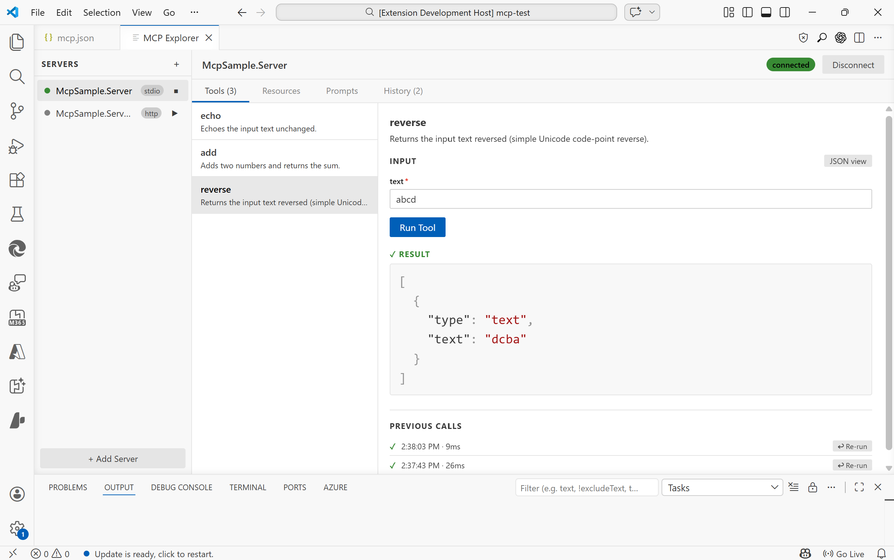

# MCP Tool Explorer

A VS Code extension for inspecting and testing [Model Context Protocol (MCP)](https://modelcontextprotocol.io) servers, directly inside your editor.

Connect to any MCP server, browse its capabilities, call tools with live input forms, read resources, and render prompts. All without leaving your editor.



---

## Features

### Server Management
- **Auto-discovery** — automatically finds servers defined in `.vscode/mcp.json` or the `mcp.servers` workspace setting
- **Manual registration** — add any server on the fly via the Add Server dialog
- **All three transports** — `stdio`, SSE, and Streamable HTTP

### Tools
- Browse all tools exposed by a server with their descriptions and parameter schemas
- **Form view** — auto-generated input form with type-aware fields (text, number, boolean toggle, enum select)
- **JSON view** — write raw JSON arguments with live validation hints (missing required fields, unknown properties)
- Run tools and see syntax-highlighted results
- **Previous calls** — the last 6 calls per tool are shown inline with one-click re-run

### Resources
- List all resources and read their contents
- Results rendered with syntax highlighting

### Prompts
- Browse and render prompts with argument input support

### Request History
- A dedicated **History** tab records every tool call, resource read, and prompt render
- See timestamp, duration, status (success / error), and expand to inspect the request arguments and response
- Re-run any past tool call directly from the timeline

### JSON Viewer
- Syntax-highlighted JSON output (keys, strings, numbers, booleans, nulls each in distinct colours)
- **Copy to clipboard** button appears on hover over any result

---

## Getting Started

### Installation

Install from the VS Code Marketplace, or build from source (see [Building](#building)).

### Opening the Explorer

- Run **`MCP: Open MCP Tool Explorer`** from the Command Palette (`Ctrl+Shift+P`)

### Auto-discovery

If your workspace has a `.vscode/mcp.json` file, servers are discovered automatically when the extension activates. Example:

```json
{
  "servers": {
    "my-stdio-server": {
      "type": "stdio",
      "command": "node",
      "args": ["./server/index.js"]
    },
    "my-http-server": {
      "type": "http",
      "url": "http://localhost:3000/mcp"
    },
    "my-sse-server": {
      "type": "sse",
      "url": "http://localhost:3001/sse"
    }
  }
}
```

### Adding a Server Manually

Click **+ Add Server** in the sidebar and fill in the connection details. Manually added servers persist for the lifetime of the VS Code window.

---

## Transports

| Type | Config&nbsp;key | Description |
|------|-----------|-------------|
| `stdio` | `command`, `args`, `env`, `cwd` | Spawns a local process |
| `http` | `url`, `headers` | Streamable HTTP (MCP 2025-03 spec) |
| `sse` | `url`, `headers` | Server-Sent Events (legacy) |

For `stdio` servers, the working directory defaults to the workspace root so relative paths in `command` resolve correctly.

---

## Building

```bash
# Install dependencies
npm install

# Build (webview + extension)
npm run build

# Watch mode (extension only)
npm run watch:extension

# Package as .vsix
npm run package
```

> The webview is a Vite + React app located in `webview-ui/`. Running `npm run build` at the root builds both the webview and the extension host automatically.

---

## Project Structure

```
src/
  extension.ts              # Extension entry point
  types.ts                  # Extension-side types
  mcp/
    McpClientManager.ts     # MCP client connections (all transports)
    McpConfigDiscovery.ts   # Server auto-discovery
  panels/
    McpToolExplorerPanel.ts # WebView panel & message bridge
webview-ui/
  src/
    App.tsx                 # Root component & state management
    components/
      Sidebar.tsx           # Server list & connection controls
      ToolsPanel.tsx        # Tools tab
      ResourcesPanel.tsx    # Resources tab
      PromptsPanel.tsx      # Prompts tab
      HistoryPanel.tsx      # History timeline tab
      JsonViewer.tsx        # Syntax-highlighted JSON renderer
      AddServerModal.tsx    # Add Server dialog
```

---

## Requirements

- VS Code 1.85 or later
- Node.js 18+ (for building from source)

---

## License

MIT
